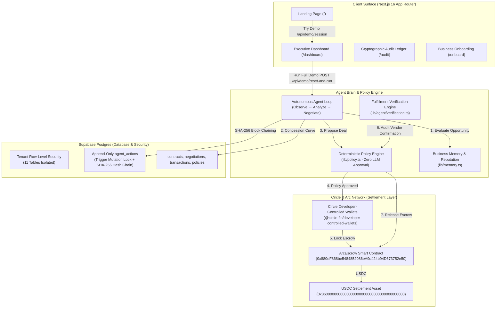

# Tavryn

> **An AI agent that finds the waste in a business's software spend, negotiates it away, and executes the financial decision in USDC on Arc.**

[-107e65?style=flat-square>)](https://tameion.thecanteenapp.com/)
[](https://opensource.org/licenses/MIT)
[](https://github.com/pvanfas/tavryn)
[](https://github.com/pvanfas/tavryn)
[-blueviolet?style=flat-square>)](https://testnet.arcscan.app/)
[-107e65?style=flat-square)](/r/12dd9d181715dd61ccf700593ef2f2ce)

---

## 1. What Tavryn Does

Corporate software and cloud contracts renew automatically whether anyone uses them or not. Provisioned user seats sit idle, cloud consumption declines, yet payments silently renew at full price because finance and IT teams lack the time to audit usage, negotiate with vendor reps, and verify renewal paperwork.

**Tavryn** is an autonomous procurement and treasury agent that closes the loop from discovery to on-chain capital allocation:

1. **Detects Renewal Waste**: Audits active seats and declining cloud usage metrics 45 days prior to contract expiration cliffs.
2. **Negotiates with Vendors**: Runs autonomous multi-round concession curves against vendor reps and APIs, anchored by historical business deal memory and strict walk-away ceilings.
3. **Enforces Hard Financial Policy**: Pure deterministic code (zero LLM approval power) verifies the deal against corporate spending limits and category budgets.
4. **Escrows USDC on Arc**: Locks commitment funds into an Arc EVM smart contract via Circle Developer-Controlled Wallets.
5. **Audits Counterparty Delivery**: Extracts terms from the vendor's counter-signed order receipt; funds are released **only** if price, seats, terms, and dates match.
6. **Learns & Remembers**: Stores concession benchmarks and updates vendor reputation scores in permanent business memory.

---

## 2. Architecture Diagram



---

## 3. The 6-Stage Autonomous Loop

| Stage            | Action                                                                                                                          | Verification & Guardrails                                                                                            |
| :--------------- | :------------------------------------------------------------------------------------------------------------------------------ | :------------------------------------------------------------------------------------------------------------------- |
| **1. Observe**   | Scans renewal calendar within 45-day window; audits active user seat allocations and declining cloud metrics.                   | Deterministic heuristics calculate verifiable dollar waste (`calculateSeatSavings`, `calculateUsageDeclineSavings`). |
| **2. Analyze**   | Formulates target price and maximum walk-away ceiling. Anchors opening offer to historical concession memory.                   | Consults `vendor_memory` for prior accepted discounts.                                                               |
| **3. Negotiate** | Executes multi-round negotiation with counterparty sales simulator over API/webhooks.                                           | Respects maximum round bounds (default 5) and strict price walk-away ceilings.                                       |
| **4. Decide**    | Evaluates negotiated outcome against company spending policy (`max_auto_transaction`, `min_savings`, allowed categories).       | **Deterministic TypeScript only.** The LLM cannot approve transactions or sign payments.                             |
| **5. Execute**   | Escrows USDC into Arc smart contract via Circle Developer-Controlled Wallets; audits vendor order confirmation; releases funds. | Concurrency unique index locks prevent double-payments; 4-field document matching prevents payment before delivery.  |
| **6. Learn**     | Computes concession speed and reputation delta (+12/8/5 pts for fast/moderate/slow close); stores deal benchmarks.              | Bound within [10, 100] reputation score scale.                                                                       |

---

## 4. Circle Tools & Arc Integration

Tavryn deeply integrates Circle's developer infrastructure and the Arc Network:

1. **Circle Developer-Controlled Wallets (`@circle-fin/developer-controlled-wallets`)**:
   - Programmatically initializes developer-controlled Smart Contract Account (SCA) wallets for businesses.
   - Signs and submits transactions server-side using Circle Entity Secret ciphertext encryption.
   - Private keys are never held in memory or accessible to the LLM agent.
2. **Circle USDC**:
   - Serves as the primary treasury asset, escrow deposit, and vendor settlement currency.
   - Interacts with Arc's native USDC precompile (`0x3600000000000000000000000000000000000000`, 6 decimals).
3. **Arc EVM Escrow Smart Contracts**:
   - Solidity contract (`ArcEscrow.sol`) deployed to the Arc Testnet.
   - Enforces on-chain policy limits (`maxPerAgreement <= 10,000 USDC`) and per-category budgets directly in EVM bytecode.
   - Role separation: Agent role can create and fund agreements; only Verifier role can release payments upon verified delivery.

### Deployed Contract Details (Arc Testnet)

| Component              | Network Address / Link                                                                                                         |
| :--------------------- | :----------------------------------------------------------------------------------------------------------------------------- |
| **Chain ID**           | `5042002` (Arc Layer-1 Testnet)                                                                                                |
| **Native RPC**         | `https://rpc.testnet.arc.network`                                                                                              |
| **Block Explorer**     | [https://testnet.arcscan.app](https://testnet.arcscan.app)                                                                     |
| **ArcEscrow Contract** | [`0x880eF868be5484852086eA9d424b94D673752e50`](https://testnet.arcscan.app/address/0x880eF868be5484852086eA9d424b94D673752e50) |
| **USDC Precompile**    | [`0x3600000000000000000000000000000000000000`](https://testnet.arcscan.app/address/0x3600000000000000000000000000000000000000) |

---

## 5. Real vs. Simulated Transparency Matrix

In accordance with rigorous transparency standards, here is the honest disclosure of what is live vs. simulated:

| Subsystem                        | Status     | Description                                                                                                                                                                                                                   |
| :------------------------------- | :--------- | :---------------------------------------------------------------------------------------------------------------------------------------------------------------------------------------------------------------------------- |
| **Relational Database**          | **Real**   | Live Supabase PostgreSQL database running in production with 11 relational tables.                                                                                                                                            |
| **Database Security (RLS)**      | **Real**   | Active PostgreSQL Row-Level Security policies enforcing strict multi-tenant isolation.                                                                                                                                        |
| **Cryptographic Audit Chain**    | **Real**   | Database triggers block UPDATE/DELETE; SHA-256 hashes sequentially chain every agent action.                                                                                                                                  |
| **Deterministic Policy Engine**  | **Real**   | Pure TypeScript mathematics evaluating category budgets, thresholds, and human escalation boundaries.                                                                                                                         |
| **Circle Developer SDK**         | **Real**   | Native `@circle-fin/developer-controlled-wallets` client wired for wallet creation and balance queries.                                                                                                                       |
| **Arc Smart Contracts**          | **Real**   | Solidity contract compiled and deployed to Arc Testnet; Hardhat unit test suite passing 7/7.                                                                                                                                  |
| **Double-Payment Locking**       | **Real**   | Partial unique PostgreSQL indexes and SHA-256 idempotency hashes blocking race conditions.                                                                                                                                    |
| **Vendor Negotiations**          | **Hybrid** | Simulated vendors use reproducible concession curves (`lib/vendor-simulator.ts`); real vendors (`is_simulated = false`) use human-in-the-loop AI outreach drafting and structured reply parsing (`lib/agent/real-vendor.ts`). |
| **Vendor Confirmation Receipts** | **Hybrid** | Deterministic verification engine audits 4 contract fields (price, seats, term, date) against pasted or simulated counterparty receipts (`lib/agent/verification.ts`).                                                        |
| **USDC Balances (Fallback)**     | **Hybrid** | Queries live Arc JSON-RPC; falls back gracefully to DB snapshot when public testnet RPC limits are hit.                                                                                                                       |

---

## 6. Zero-Trust Security & Hardening

- **Append-Only Database Triggers**: `prevent_agent_actions_mutation()` raises PostgreSQL exceptions on any `UPDATE` or `DELETE` attempted on `agent_actions`.
- **SHA-256 Hash Chain**: Each action block links to the prior block's hash. The `/audit` page verifies the integrity of the chain in real time.
- **Double-Payment Elimination**: Partial unique index `idx_transactions_unique_negotiation` guarantees that concurrent or re-tried calls resolve idempotently to exactly 1 transaction.
- **Wallet Mutation Defense**: `create_escrow` cross-checks recipient addresses against registered vendor profiles; any mutation freezes execution for human approval.
- **Tenant Isolation**: Row-Level Security ensures authenticated users of Business A cannot read or modify Business B's contracts, policies, or audit logs.
- **API Hardening**: Zod schemas validate all 11 API endpoints; sliding-window rate limiters protect agent and cron routes; sensitive secrets and tokens are masked in logs.

---

## 7. How to Run Locally (Fresh Clone)

### Prerequisites

- Node.js 20+ (Node 22+ recommended)
- npm 10+
- A free [Supabase](https://supabase.com) project (or use seeded connection)

### 1. Clone & Install

```bash
git clone https://github.com/pvanfas/tavryn.git
cd tavryn
npm install
```

### 2. Environment Configuration

Copy `.env.example` to `.env.local`:

```bash
cp .env.example .env.local
```

Configure your credentials in `.env.local`:

```env
NEXT_PUBLIC_SUPABASE_URL=https://your-project.supabase.co
NEXT_PUBLIC_SUPABASE_ANON_KEY=your-anon-key
SUPABASE_SERVICE_ROLE_KEY=your-service-role-key

LLM_PROVIDER=openai
OPENAI_API_KEY=your-openai-api-key

CIRCLE_API_KEY=your-circle-api-key
CIRCLE_ENTITY_SECRET=your-32-byte-hex-entity-secret
CIRCLE_BLOCKCHAIN=ARC-TESTNET

NEXT_PUBLIC_ARC_RPC_URL=https://rpc.testnet.arc.network
NEXT_PUBLIC_ARC_CHAIN_ID=5042002
NEXT_PUBLIC_USDC_CONTRACT_ADDRESS=0x3600000000000000000000000000000000000000
NEXT_PUBLIC_ESCROW_CONTRACT_ADDRESS=0x880eF868be5484852086eA9d424b94D673752e50

CRON_SECRET=tavryn_cron_secret_2026
RENEWAL_WINDOW_DAYS=45
IDEMPOTENCY_WINDOW_DAYS=14
```

### 3. Seed Database & Testnet Wallets

Seed Demo Co, spending policies, and contracts for Slack, Datadog, and AWS:

```bash
npm run seed
```

### 4. Run Verification Test Suite

Run all 90 unit and integration tests:

```bash
npm test
```

Run Playwright end-to-end tests:

```bash
npm run test:e2e
```

### 5. Launch Development Server

```bash
npm run dev
```

Open [http://localhost:3000](http://localhost:3000) in your browser:

- Logged-out visitors see the **Landing Page** with the one-line pitch, hero metrics, and 3-step loop.
- Click **"Try the demo"** to immediately open Demo Co on `/dashboard`.
- Click **"Run full demo"** on the dashboard to watch the 7-step autonomous procurement engine execute live in the Activity Timeline.
- Click **"Audit Ledger"** (`/audit`) to verify the cryptographic SHA-256 chain.

---

## 8. Vercel Deployment Checklist

Tavryn is architected as a standard Next.js App Router application ready for 1-click Vercel deployment:

### Required Vercel Environment Variables

- [x] `NEXT_PUBLIC_SUPABASE_URL`
- [x] `NEXT_PUBLIC_SUPABASE_ANON_KEY`
- [x] `SUPABASE_SERVICE_ROLE_KEY`
- [x] `LLM_PROVIDER` (`openai` or `anthropic`)
- [x] `OPENAI_API_KEY` or `ANTHROPIC_API_KEY`
- [x] `CIRCLE_API_KEY`
- [x] `CIRCLE_ENTITY_SECRET`
- [x] `CIRCLE_BLOCKCHAIN` (`ARC-TESTNET`)
- [x] `NEXT_PUBLIC_ARC_RPC_URL` (`https://rpc.testnet.arc.network`)
- [x] `NEXT_PUBLIC_ARC_CHAIN_ID` (`5042002`)
- [x] `NEXT_PUBLIC_USDC_CONTRACT_ADDRESS` (`0x3600000000000000000000000000000000000000`)
- [x] `NEXT_PUBLIC_ESCROW_CONTRACT_ADDRESS` (`0x880eF868be5484852086eA9d424b94D673752e50`)
- [x] `CRON_SECRET` (used by Vercel Cron to authenticate `GET /api/cron/daily`)
- [x] `RENEWAL_WINDOW_DAYS` (`45`)
- [x] `IDEMPOTENCY_WINDOW_DAYS` (`14`)

### Vercel Cron Job Configuration

`vercel.json` automatically schedules daily proactive renewal evaluations at 08:00 UTC:

```json
{
  "crons": [
    {
      "path": "/api/cron/daily",
      "schedule": "0 8 * * *"
    }
  ]
}
```

---

## 9. Traction & Future Roadmap

- **Phase 1 (Autonomous Core MVP - Completed)**: Autonomous SaaS waste detection, multi-round vendor concession curves, pure deterministic policy engine, Arc smart contract escrow, Circle Developer-Controlled Wallets, tamper-proof append-only audit trail, and zero-context demo mode.
- **Phase 2 (Vendor API Integrations - In Progress)**: Native OAuth connectors for Google Workspace, Salesforce, Zoom, and AWS Marketplace to ingest real-time seat provisioning and usage metering.
- **Phase 3 (Mainnet Treasury & Stablecoin Yield)**: Production Arc Mainnet deployment with idle treasury yield generation while commitment funds await renewal milestone fulfillment.

---

## Acknowledgements

Built for **Tameion Agents** (Circle x Canteen). Settled on Arc Network. Smart contract escrow architecture adapted from [`circlefin/arc-escrow`](https://github.com/circlefin/arc-escrow).
