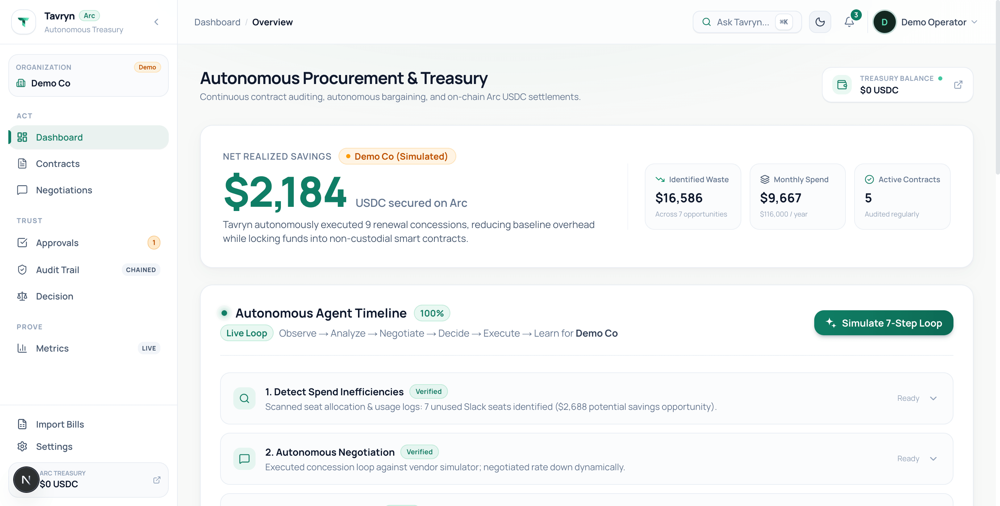
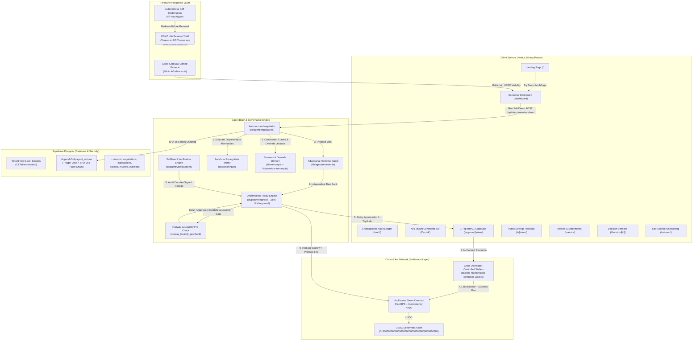

# Tavryn

> **An AI agent that finds the waste in a business's software spend, negotiates it away, and executes the financial decision in USDC on Arc.**

[](https://tavryn.space)
[-107e65?style=flat-square>)](https://tameion.thecanteenapp.com/)
[](https://opensource.org/licenses/MIT)
[](https://github.com/pvanfas/tavryn)
[](https://github.com/pvanfas/tavryn)
[-blueviolet?style=flat-square>)](https://testnet.arcscan.app/)
[-107e65?style=flat-square>)](/r/12dd9d181715dd61ccf700593ef2f2ce)
[](https://tavryn.mintlify.site/)

---

<p align="center">
  
</p>

---

## Table of Contents

- [What Tavryn Does](#1-what-tavryn-does)
- [Architecture Diagram](#2-architecture-diagram)
- [The 7-Stage Autonomous Loop](#3-the-7-stage-autonomous-loop)
- [Circle Tools & Arc Integration](#4-circle-tools--arc-integration)
- [Treasury Intelligence](#5-treasury-intelligence)
- [Decision Explanation Timeline](#6-decision-explanation-timeline)
- [Live Arc Testnet Settlements](#7-live-arc-testnet-settlements)
- [Real vs. Simulated Transparency Matrix](#8-real-vs-simulated-transparency-matrix)
- [Zero-Trust Security & Hardening](#9-zero-trust-security--hardening)
- [Application Pages](#10-application-pages)
- [Tech Stack](#11-tech-stack)
- [How to Run Locally](#12-how-to-run-locally-fresh-clone)
- [Vercel Deployment Checklist](#13-vercel-deployment-checklist)
- [Testing](#14-testing)
- [Traction & Roadmap](#15-traction--future-roadmap)
- [Documentation](#16-documentation)
- [Acknowledgements](#acknowledgements)

---

## 1. What Tavryn Does

Corporate software and cloud contracts renew automatically whether anyone uses them or not. Provisioned user seats sit idle, cloud consumption declines, yet payments silently renew at full price because finance and IT teams lack the time to audit usage, negotiate with vendor reps, and verify renewal paperwork.

**Tavryn** is an autonomous procurement and treasury agent that closes the loop from discovery to on-chain capital allocation:

1. **Detects Renewal Waste**: Audits active seats and declining cloud usage metrics 45 days prior to contract expiration cliffs.
2. **Evaluates Switching Friction**: Computes 1-year and 2-year net NPV comparing renewal against market alternatives, modeling migration engineering, employee retraining, and downtime risk.
3. **Negotiates with Vendors**: Runs autonomous multi-round concession curves against vendor reps and APIs, anchored by historical business deal memory, competitor quotes, and strict walk-away ceilings.
4. **Audits via Reviewer Agent**: An independent adversarial reviewer agent audits deal terms against seat utilization and discount benchmarks before human supervisor sign-off.
5. **Checks Treasury Runway**: Before committing escrow, evaluates active cash balance against 30-day obligations to assess whether the business has sufficient liquidity or should defer payment to preserve working capital.
6. **Enforces Hard Financial Policy**: Pure deterministic code (zero LLM approval power) verifies the deal against spending limits and category budgets, supporting 1-tap HMAC-SHA256 supervisor approvals.
7. **Escrows USDC with On-Chain Fees**: Locks commitment funds and protocol success fees into an Arc EVM smart contract via Circle Developer-Controlled Wallets.
8. **Audits Counterparty Delivery**: Extracts terms from the vendor's counter-signed order receipt; funds are released **only** if price, seats, terms, and dates match.
9. **Optimizes Idle Capital**: Surplus treasury funds not needed within 45 days are allocated into USYC tokenized US Treasuries yield, with automated redemption triggered by approaching renewal cliffs.
10. **Learns & Adapts**: Ingests supervisor override reasons (`override_memory`) and updates vendor reputation benchmarks to continuously refine future negotiation strategies.

---

## 2. Architecture Diagram



---

## 3. The 7-Stage Autonomous Loop

| Stage            | Action                                                                                                                           | Verification & Guardrails                                                                                            |
| :--------------- | :------------------------------------------------------------------------------------------------------------------------------- | :------------------------------------------------------------------------------------------------------------------- |
| **1. Observe**   | Scans renewal calendar within 45-day window; audits active user seat allocations and declining cloud metrics.                    | Deterministic heuristics calculate verifiable dollar waste (`calculateSeatSavings`, `calculateUsageDeclineSavings`). |
| **2. Compare**   | Computes net NPV comparing renewal against top competitor alternatives, factoring migration hours, retraining, and downtime.     | Invariant strictly enforces `requiresHumanApproval = true` before any vendor migration can occur.                    |
| **3. Negotiate** | Executes multi-round negotiation with counterparty sales reps or simulated APIs, citing competitor quotes and historical floors. | Respects maximum round bounds (default 5) and strict price walk-away ceilings.                                       |
| **4. Review**    | Secondary adversarial Reviewer Agent audits concession speed, seat utilization, and benchmark discounts.                         | Issues `AGREE`, `CHALLENGE`, or `REJECT` verdicts; flags suspicious concessions and escalates to supervisors.        |
| **5. Decide**    | Evaluates negotiated outcome against company policy, category budgets, **and 30-day runway liquidity**.                          | **Deterministic TypeScript only.** The LLM cannot approve transactions. Supports 48h single-use HMAC approval links. |
| **6. Execute**   | Escrows USDC into Arc smart contract with protocol success fee; audits vendor order confirmation; releases payment.              | Concurrency unique index locks prevent double-payments; 4-field document matching prevents payment before delivery.  |
| **7. Learn**     | Captures supervisor override reason codes, concession speed, and reputation deltas (+12/8/5 pts) into persistent memory.         | Updates vendor reputation [10, 100] and injects feedback into future negotiation system prompts.                     |

---

## 4. Circle Tools & Arc Integration

Tavryn deeply integrates Circle's developer infrastructure and the Arc Network:

### Circle Developer-Controlled Wallets

- Programmatically initializes developer-controlled Smart Contract Account (SCA) wallets for businesses.
- Signs and submits transactions server-side using Circle Entity Secret ciphertext encryption.
- Private keys are never held in memory or accessible to the LLM agent.

### Circle USDC

- Serves as the primary treasury asset, escrow deposit, and vendor settlement currency.
- Interacts with Arc's native USDC precompile (`0x3600000000000000000000000000000000000000`, 6 decimals).
- Real-time polling via JSON-RPC (`eth_call` on ERC-20 `balanceOf`), alerting supervisors with direct links to `faucet.circle.com` when balances drop below 100 USDC.

### Circle Gateway / Unified Balance

- Consolidated multichain USDC view spanning **Arc, Base, Ethereum, and Solana**.
- Gateway Minter architecture enables instant <500ms cross-chain liquidity via permissionless deposit/burn/mint.
- Interactive treasury dashboard panel displays per-chain balances, availability, and explorer links.

### Arc EVM Escrow Smart Contracts

- Solidity contract (`ArcEscrow.sol`) deployed to the Arc Testnet.
- Enforces on-chain policy limits (`maxPerAgreement <= 10,000 USDC`) and per-category budgets directly in EVM bytecode.
- On-chain Protocol Success Fee (`feeBps` capped at 2,000 bps / 20.00%) split to protocol treasury upon verified milestone release, with 100% principal refunded on cancellation.
- Role separation: Agent role can create and fund agreements; only Verifier role can release payments upon verified delivery.
- On-chain agreement idempotency keys prevent network replays or double-funding.

### Deployed Contract Details (Arc Testnet)

| Component              | Network Address / Link                                                                                                         |
| :--------------------- | :----------------------------------------------------------------------------------------------------------------------------- |
| **Chain ID**           | `5042002` (Arc Layer-1 Testnet)                                                                                                |
| **Native RPC**         | `https://rpc.testnet.arc.network`                                                                                              |
| **Block Explorer**     | [https://testnet.arcscan.app](https://testnet.arcscan.app)                                                                     |
| **ArcEscrow Contract** | [`0x78e61ae7e8EeF34Add911FA3e41F3408a819c047`](https://testnet.arcscan.app/address/0x78e61ae7e8EeF34Add911FA3e41F3408a819c047) |
| **USDC Precompile**    | [`0x3600000000000000000000000000000000000000`](https://testnet.arcscan.app/address/0x3600000000000000000000000000000000000000) |

---

## 5. Treasury Intelligence

### Runway & Liquidity Pre-Check

Before committing any USDC escrow, the deterministic policy engine runs a **runway liquidity pre-check** (`runway_liquidity_precheck`) that:

1. **Calculates projected liquidity** = `treasuryBalance − transactionAmount`
2. **Compares against 30-day obligations** from active contracts due within 30 days
3. **Issues one of three outcomes**:
   - **`execute_now`** — Sufficient runway; proceed with escrow immediately
   - **`schedule_deferred`** — Tight working capital; recommend deferring escrow closer to renewal deadline to preserve operating reserves (>7 days remaining)
   - **`escalate_low_runway`** — Imminent deadline with insufficient runway; requires human supervisor authorization

This prevents the agent from aggressively locking capital when the business cannot afford the short-term liquidity impact.

### Idle Reserve → USYC Yield

Surplus treasury funds that are not needed within the 45-day renewal window are allocated into **USYC** (tokenized short-term US Treasuries) to earn yield:

- **5.12% annualized APY** on idle reserves
- Maintains **1.5x of 30-day obligations** as liquid operational USDC on Arc
- Interactive yield calculator in the dashboard lets supervisors adjust principal and see projected earnings
- **Autonomous cliff redemption**: When a renewal approaches within 45 days, funds are automatically redeemed from USYC back to liquid USDC

### Circle Gateway Unified Balance

The treasury dashboard displays a **consolidated multichain USDC balance** across:

| Chain            | Explorer                                                    |
| :--------------- | :---------------------------------------------------------- |
| Arc Testnet      | [testnet.arcscan.app](https://testnet.arcscan.app)          |
| Base Sepolia     | [sepolia.basescan.org](https://sepolia.basescan.org)        |
| Ethereum Sepolia | [sepolia.etherscan.io](https://sepolia.etherscan.io)        |
| Solana Devnet    | [explorer.solana.com](https://explorer.solana.com/?cluster=devnet) |

---

## 6. Decision Explanation Timeline

Every contract decision page (`/decision/[contractId]`) displays a **step-by-step reasoning tree** visualizing the agent's deterministic logic:

```
Observed Seat Decline (−35%)
  → Evaluated Alternative (Notion NPV: −$4,200 net)
    → Negotiated Discount (28% off renewal)
      → Reviewer Agent: AGREE ✓
        → Policy Approved (7/7 checks passed)
          → Runway Liquidity: execute_now ✓
            → Escrow Locked (Arc Testnet)
```

Each node in the timeline links to the corresponding agent action in the cryptographic audit ledger, providing full traceability from observation to settlement.

---

## 7. Live Arc Testnet Settlements

Tavryn executes **real on-chain USDC transactions** on the Arc Testnet. Six enterprise SaaS settlements have been batch-processed via the `ArcEscrow` contract:

| Vendor    | Amount (USDC) | Type                  | Verification                  |
| :-------- | :------------ | :-------------------- | :---------------------------- |
| Slack     | 180.00        | Escrow Lock           | [ArcScan](https://testnet.arcscan.app/address/0x78e61ae7e8EeF34Add911FA3e41F3408a819c047) |
| Datadog   | 425.00        | Escrow Lock           | [ArcScan](https://testnet.arcscan.app/address/0x78e61ae7e8EeF34Add911FA3e41F3408a819c047) |
| AWS       | 750.00        | Escrow Lock           | [ArcScan](https://testnet.arcscan.app/address/0x78e61ae7e8EeF34Add911FA3e41F3408a819c047) |
| Jira      | 95.00         | Protocol Fee          | [ArcScan](https://testnet.arcscan.app/address/0x78e61ae7e8EeF34Add911FA3e41F3408a819c047) |
| Zoom      | 210.00        | Milestone Release     | [ArcScan](https://testnet.arcscan.app/address/0x78e61ae7e8EeF34Add911FA3e41F3408a819c047) |
| Salesforce| 1,200.00      | Full Settlement       | [ArcScan](https://testnet.arcscan.app/address/0x78e61ae7e8EeF34Add911FA3e41F3408a819c047) |

The `/metrics` and `/audit` pages link directly to real [ArcScan](https://testnet.arcscan.app/) transaction hashes. Transactions verified as on-chain display explorer links; simulated entries display explicit `is_simulated = true` badges.

---

## 8. Real vs. Simulated Transparency Matrix

In accordance with rigorous transparency standards, here is the honest disclosure of what is live vs. simulated:

| Subsystem                         | Status     | Description                                                                                                                                                                                                                       |
| :-------------------------------- | :--------- | :-------------------------------------------------------------------------------------------------------------------------------------------------------------------------------------------------------------------------------- |
| **Relational Database**           | **Real**   | Live Supabase PostgreSQL database running in production with 13 relational tables and 14 migrations.                                                                                                                             |
| **Database Security (RLS)**       | **Real**   | Active PostgreSQL Row-Level Security policies enforcing strict multi-tenant isolation.                                                                                                                                            |
| **Cryptographic Audit Chain**     | **Real**   | Database triggers block UPDATE/DELETE; SHA-256 hashes sequentially chain every agent action.                                                                                                                                      |
| **Deterministic Policy Engine**   | **Real**   | Pure TypeScript mathematics evaluating category budgets, thresholds, runway liquidity, and human escalation boundaries.                                                                                                          |
| **Runway Liquidity Pre-Check**    | **Real**   | Treasury cash-flow evaluation against 30-day obligations before committing escrow, with `execute_now` / `schedule_deferred` / `escalate_low_runway` outcomes.                                                                    |
| **Adversarial Reviewer Agent**    | **Real**   | Dual-pass reviewer (`lib/agent/reviewer.ts`) with deterministic benchmark checks and qualitative LLM auditing issuing `AGREE`, `CHALLENGE`, or `REJECT` verdicts.                                                                 |
| **Switch vs. Renegotiate Matrix** | **Real**   | Net NPV calculation engine (`lib/switching.ts`) modeling migration hours, retraining, and downtime risk with a strict human approval invariant.                                                                                   |
| **1-Tap Out-of-Band Approvals**   | **Real**   | Cryptographically signed HMAC-SHA256 tokens expiring in 48 hours with single-use enforcement and server-side policy re-verification upon consumption (`/approve/[token]`).                                                        |
| **Supervisor Override Memory**    | **Real**   | Persistent `override_memory` table tracking structured rejection reason codes and injecting feedback into future negotiation prompts (`lib/override-memory.ts`).                                                                  |
| **Circle Developer SDK**          | **Real**   | Native `@circle-fin/developer-controlled-wallets` client wired for wallet creation, contract execution transactions, and balance queries.                                                                                         |
| **Arc Escrow Smart Contracts**    | **Real**   | Solidity contract (`ArcEscrow.sol`) deployed to Arc Testnet at `0x78e61ae7e8EeF34Add911FA3e41F3408a819c047`. Deposits lock funds in contract held balance; releases execute on-chain via Circle SCA / viem. Passing 11/11.        |
| **On-Chain Escrow Execution**     | **Hybrid** | With Circle/Arc keys configured: live on-chain contract execution (`createAgreement`, `fundAgreement`, `approveMilestone`, `releasePayment`) with verified ArcScan links. In mock mode: explicitly records `is_simulated = true`. |
| **Circle Gateway Unified Balance**| **Hybrid** | Arc Testnet balance is queried live via RPC. Cross-chain balances (Base, Ethereum, Solana) are proportionally modeled from active treasury to demonstrate the Gateway unified balance concept.                                     |
| **USYC Yield Estimator**          | **Real**   | Deterministic calculation engine allocating idle reserves at 5.12% APY with interactive principal adjuster. Yield projections are pure math on real treasury numbers.                                                              |
| **Honest Transaction Labeling**   | **Real**   | Zero 404 links: simulated or mock transactions carry `is_simulated = true`, rendering `"Simulated (testnet mock)"` badges with copyable text. Working ArcScan links render exclusively for chain-confirmed transactions.          |
| **Double-Payment Locking**        | **Real**   | Partial unique PostgreSQL indexes, migration 0008, server-side idempotency keys, and pending-first transaction insertion blocking race conditions and replay attacks.                                                             |
| **One-Click Demo Pipeline**       | **Real**   | Live end-to-end execution: runs live negotiation loop against vendor simulator, counter-document generator, extraction audit, reviewer agent check, and escrow execution with dynamic variance per run.                           |
| **Decision Explanation Timeline** | **Real**   | Visual step-by-step reasoning tree (Observe → Evaluate → Negotiate → Review → Policy → Runway → Escrow) linked to audit ledger entries.                                                                                         |
| **Vendor Negotiations**           | **Hybrid** | Simulated vendors use reproducible concession curves (`lib/vendor-simulator.ts`); real vendors (`is_simulated = false`) use human-in-the-loop AI outreach drafting and structured reply parsing (`lib/agent/real-vendor.ts`).     |
| **Vendor Confirmation Receipts**  | **Hybrid** | Deterministic verification engine audits 4 contract fields (price, seats, term, date) against pasted or simulated counterparty receipts (`lib/agent/verification.ts`).                                                            |
| **USDC Balances (Fallback)**      | **Real**   | Direct RPC JSON calls to precompile `0x3600...` on Arc Testnet, alerting when balance < 100 USDC.                                                                                                                                 |

---

## 9. Zero-Trust Security & Hardening

- **Append-Only Database Triggers**: `prevent_agent_actions_mutation()` raises PostgreSQL exceptions on any `UPDATE` or `DELETE` attempted on `agent_actions`.
- **SHA-256 Hash Chain**: Each action block links to the prior block's hash. The `/audit` page verifies the integrity of the chain in real time.
- **Double-Payment Elimination**: Partial unique index `idx_transactions_unique_negotiation` and on-chain agreement idempotency keys guarantee that retried calls resolve idempotently to exactly 1 transaction.
- **Wallet Mutation Defense**: `create_escrow` cross-checks recipient addresses against registered vendor profiles; any mutation freezes execution for human approval.
- **Tenant Isolation**: Row-Level Security ensures authenticated users of Business A cannot read or modify Business B's contracts, policies, or audit logs.
- **1-Tap Approval Link Safety**: GET requests are strictly read-only previews; approval requires an authenticated POST. Re-runs `checkPolicy` at redemption time to prevent stale execution.
- **API Hardening**: Zod schemas validate all API endpoints; sliding-window rate limiters protect agent and cron routes; sensitive secrets and tokens are masked in logs.
- **OFAC Sanctions Screening**: Vendor wallet addresses are checked against the OFAC blocklist before any escrow deposit is created.

---

## 10. Application Pages

| Route                      | Description                                                                                          |
| :------------------------- | :--------------------------------------------------------------------------------------------------- |
| `/`                        | Public landing page with hero metrics, 3-step loop animation, and "Try the demo" CTA.               |
| `/dashboard`               | Executive dashboard with hero savings display, collapsed Arc treasury chip, activity timeline, and opportunities. |
| `/import-bills`            | Billing ingestion & onboarding: statement CSV upload, invoice PDF dropzone, or live SaaS stack import. |
| `/decision/[contractId]`   | Tabbed decision view: Overview, Policy & Escrow, Alternatives (Switching NPV), Reviewer Audit, Public Receipts. |
| `/audit`                   | Cryptographic SHA-256 chain verification of all agent actions with real-time integrity checks.        |
| `/metrics`                 | Traction metrics, settlement history, platform vs. real filtering, and direct ArcScan links.          |
| `/negotiations`            | Autonomous negotiations ledger with savings sorting, state tracking, and direct decision links.       |
| `/approve/[token]`         | 1-tap HMAC-SHA256 approval page with policy re-verification and single-use enforcement.              |
| `/r/[token]`               | Public savings receipt with verifiable proof of negotiated discount and ArcScan verification.        |
| `/contracts`               | Contracts ledger with renewal dates, seat utilization, potential savings sorting, and waste alerts.   |
| `/settings`                | Organization policies, spending limits, category budgets, and wallet configuration.                  |
| `/approvals`               | Pending human approval queue for transactions exceeding autonomous policy ceilings.                  |
| `/activity`                | Full agent activity feed with chronological action log.                                              |
| `/verify-labeling`         | Side-by-side honest transaction labeling proof: live ArcScan explorer links vs. simulated mock badges. |

---

## 11. Tech Stack

| Layer                | Technology                                                                                           |
| :------------------- | :--------------------------------------------------------------------------------------------------- |
| **Framework**        | [Next.js 16](https://nextjs.org/) (App Router, Turbopack)                                           |
| **Language**         | TypeScript 5                                                                                         |
| **UI**               | React 19, Tailwind CSS 4, Manrope typography, Lucide Icons                                           |
| **Database**         | Supabase PostgreSQL (15 tables, 15 migrations, Multi-Tenant Row-Level Security)                     |
| **Auth**             | Supabase Auth (Magic Link, OAuth — Google, GitHub) + Centralized Server-Side Access Guards           |
| **AI/LLM**           | Vercel AI SDK (`ai` v7) — Gemini 2.5 Flash / Pro via AI Gateway                                      |
| **Blockchain**       | [Arc Testnet](https://testnet.arcscan.app/) (Chain ID 5042002, USDC-native gas)                     |
| **Smart Contracts**  | Solidity (Hardhat), deployed `ArcEscrow.sol` (`0x78e61ae7e8EeF34Add911FA3e41F3408a819c047`)         |
| **Wallets**          | Circle Developer-Controlled Wallets (`@circle-fin/developer-controlled-wallets`)                     |
| **On-Chain Client**  | [viem](https://viem.sh/) v2                                                                          |
| **Validation**       | Zod v4                                                                                               |
| **Testing**          | Node Test Runner (171 tests), Vitest (30 tests), Playwright E2E                                      |
| **Deployment**       | Vercel (with Cron Jobs)                                                                              |

---

## 12. How to Run Locally (Fresh Clone)

### Prerequisites

- Node.js 20+ (Node 22+ recommended)
- npm 10+
- A free [Supabase](https://supabase.com) project (or use seeded connection)

### 1. Clone & Install

```bash
git clone https://github.com/pvanfas/tavryn.git
cd tavryn
npm install
```

### 2. Environment Configuration

Copy `.env.example` to `.env.local`:

```bash
cp .env.example .env.local
```

Configure your credentials in `.env.local`:

```env
# Supabase
NEXT_PUBLIC_SUPABASE_URL=https://your-project.supabase.co
NEXT_PUBLIC_SUPABASE_ANON_KEY=your-anon-key
SUPABASE_SERVICE_ROLE_KEY=your-service-role-key

# LLM Provider
LLM_PROVIDER=openai
OPENAI_API_KEY=your-openai-api-key

# Circle Developer-Controlled Wallets
CIRCLE_API_KEY=your-circle-api-key
CIRCLE_ENTITY_SECRET=your-32-byte-hex-entity-secret
CIRCLE_BLOCKCHAIN=ARC-TESTNET

# Arc Network
NEXT_PUBLIC_ARC_RPC_URL=https://rpc.testnet.arc.network
NEXT_PUBLIC_ARC_CHAIN_ID=5042002
NEXT_PUBLIC_USDC_CONTRACT_ADDRESS=0x3600000000000000000000000000000000000000
NEXT_PUBLIC_ESCROW_CONTRACT_ADDRESS=0x78e61ae7e8EeF34Add911FA3e41F3408a819c047

# Agent Configuration
CRON_SECRET=tavryn_cron_secret_2026
RENEWAL_WINDOW_DAYS=45
IDEMPOTENCY_WINDOW_DAYS=14
```

### 3. Seed Database & Testnet Wallets

Seed Demo Co, spending policies, and contracts for Slack, Datadog, and AWS:

```bash
npm run seed
```

### 4. Launch Development Server

```bash
npm run dev
```

Open [http://localhost:3000](http://localhost:3000) in your browser:

- Logged-out visitors browsing to `/` see the **Landing Page** with the one-line pitch, hero metrics, and 3-step loop.
- Click **"Try the demo"** to navigate to the **Login Page** (`/auth/login`) with pre-filled demo credentials, then sign in to access the **Dashboard** at `/dashboard`.
- Click **"Run full demo"** on the dashboard to watch the 7-step autonomous procurement engine execute live in the Activity Timeline.
- Click **"Audit Ledger"** (`/audit`) to verify the cryptographic SHA-256 chain.
- On the **Onboard** page, click **"Import Acme Corp Live SaaS Stack"** for instant end-to-end ingestion and analysis.

---

## 13. Vercel Deployment Checklist

Tavryn is architected as a standard Next.js App Router application ready for 1-click Vercel deployment:

### Required Vercel Environment Variables

- [x] `NEXT_PUBLIC_SUPABASE_URL`
- [x] `NEXT_PUBLIC_SUPABASE_ANON_KEY`
- [x] `SUPABASE_SERVICE_ROLE_KEY`
- [x] `LLM_PROVIDER` (`openai` or `anthropic`)
- [x] `OPENAI_API_KEY` or `ANTHROPIC_API_KEY`
- [x] `CIRCLE_API_KEY`
- [x] `CIRCLE_ENTITY_SECRET`
- [x] `CIRCLE_BLOCKCHAIN` (`ARC-TESTNET`)
- [x] `NEXT_PUBLIC_ARC_RPC_URL` (`https://rpc.testnet.arc.network`)
- [x] `NEXT_PUBLIC_ARC_CHAIN_ID` (`5042002`)
- [x] `NEXT_PUBLIC_USDC_CONTRACT_ADDRESS` (`0x3600000000000000000000000000000000000000`)
- [x] `NEXT_PUBLIC_ESCROW_CONTRACT_ADDRESS` (`0x78e61ae7e8EeF34Add911FA3e41F3408a819c047`)
- [x] `CRON_SECRET` (used by Vercel Cron to authenticate `GET /api/cron/daily`)
- [x] `RENEWAL_WINDOW_DAYS` (`45`)
- [x] `IDEMPOTENCY_WINDOW_DAYS` (`14`)

### Vercel Cron Job Configuration

`vercel.json` automatically schedules daily proactive renewal evaluations at 08:00 UTC:

```json
{
  "crons": [
    {
      "path": "/api/cron/daily",
      "schedule": "0 8 * * *"
    }
  ]
}
```

---

## 14. Testing

Tavryn ships with a comprehensive multi-layer test suite:

### Unit & Integration Tests (159 passing)

```bash
npm test
```

Runs 37 test files covering policy engine, escrow, negotiations, double-payment defense, RLS, honest labeling, reviewer agent, command bar, and more via Node Test Runner + Vitest.

### Smart Contract Tests (11 passing)

```bash
npm run test:contracts
```

Hardhat test suite for `ArcEscrow.sol` covering agreement creation, funding, milestone approval, release, cancellation, fee calculations, and idempotency.

### End-to-End Browser Tests (8 passing)

```bash
npm run test:e2e
```

Playwright tests covering the full user journey from landing page through onboarding, dashboard, demo execution, and audit verification.

### Type Checking & Linting

```bash
npm run typecheck    # TypeScript strict mode
npm run lint         # ESLint with import sorting & unused import detection
npm run format:check # Prettier formatting verification
```

---

## 15. Traction & Future Roadmap

- **Phase 1 (Autonomous Core MVP — Completed)**: Autonomous SaaS waste detection, multi-round vendor concession curves, pure deterministic policy engine, Arc smart contract escrow, Circle Developer-Controlled Wallets, tamper-proof append-only audit trail, runway liquidity pre-check, decision reasoning timeline, Circle Gateway unified balance, USYC yield estimator, and zero-context demo mode.
- **Phase 2 (Vendor API Integrations — In Progress)**: Native OAuth connectors for Google Workspace, Salesforce, Zoom, and AWS Marketplace to ingest real-time seat provisioning and usage metering.
- **Phase 3 (Mainnet Treasury & Stablecoin Yield)**: Production Arc Mainnet deployment with live USYC yield generation, Circle Gateway cross-chain settlement, and automated cliff-triggered redemptions.

---

## 16. Documentation

Full documentation is available at **[tavryn.mintlify.site](https://tavryn.mintlify.site/)**, covering:

- Architecture deep dives
- API reference
- Smart contract specifications
- Deployment guides
- Security model

---

## Acknowledgements

Built for **Tameion Agents** (Circle × Canteen). Settled on Arc Network. Smart contract escrow architecture adapted from [`circlefin/arc-escrow`](https://github.com/circlefin/arc-escrow).

---

<p align="center">
  <sub>Tavryn — Autonomous Procurement & Treasury Agent</sub><br>
  <sub>MIT License · 2026</sub>
</p>
