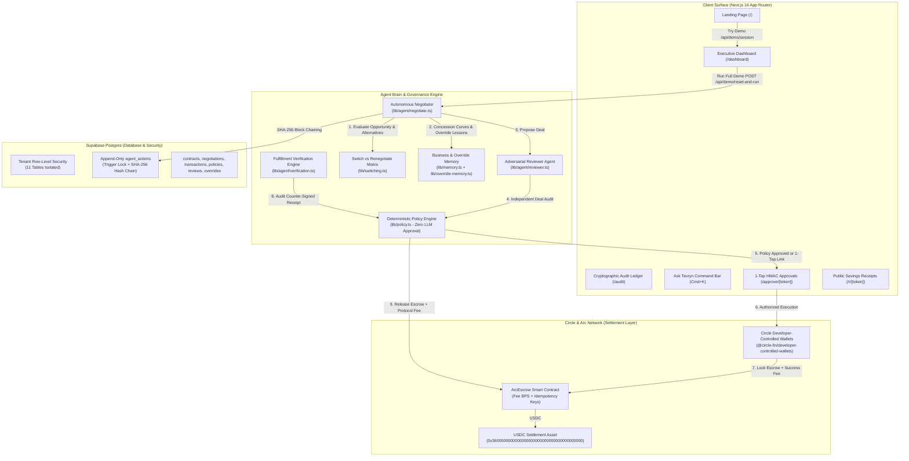

# Tavryn

> **An AI agent that finds the waste in a business's software spend, negotiates it away, and executes the financial decision in USDC on Arc.**

[-107e65?style=flat-square>)](https://tameion.thecanteenapp.com/)
[](https://opensource.org/licenses/MIT)
[](https://github.com/pvanfas/tavryn)
[](https://github.com/pvanfas/tavryn)
[-blueviolet?style=flat-square>)](https://testnet.arcscan.app/)
[-107e65?style=flat-square>)](/r/12dd9d181715dd61ccf700593ef2f2ce)

---

## 1. What Tavryn Does

Corporate software and cloud contracts renew automatically whether anyone uses them or not. Provisioned user seats sit idle, cloud consumption declines, yet payments silently renew at full price because finance and IT teams lack the time to audit usage, negotiate with vendor reps, and verify renewal paperwork.

**Tavryn** is an autonomous procurement and treasury agent that closes the loop from discovery to on-chain capital allocation:

1. **Detects Renewal Waste**: Audits active seats and declining cloud usage metrics 45 days prior to contract expiration cliffs.
2. **Evaluates Switching Friction**: Computes 1-year and 2-year net NPV comparing renewal against market alternatives, modeling migration engineering, employee retraining, and downtime risk.
3. **Negotiates with Vendors**: Runs autonomous multi-round concession curves against vendor reps and APIs, anchored by historical business deal memory, competitor quotes, and strict walk-away ceilings.
4. **Audits via Reviewer Agent**: An independent adversarial reviewer agent audits deal terms against seat utilization and discount benchmarks before human supervisor sign-off.
5. **Enforces Hard Financial Policy**: Pure deterministic code (zero LLM approval power) verifies the deal against spending limits and category budgets, supporting 1-tap HMAC-SHA256 supervisor approvals.
6. **Escrows USDC with On-Chain Fees**: Locks commitment funds and protocol success fees into an Arc EVM smart contract via Circle Developer-Controlled Wallets.
7. **Audits Counterparty Delivery**: Extracts terms from the vendor's counter-signed order receipt; funds are released **only** if price, seats, terms, and dates match.
8. **Learns & Adapts**: Ingests supervisor override reasons (`override_memory`) and updates vendor reputation benchmarks to continuously refine future negotiation strategies.

---

## 2. Architecture Diagram



---

## 3. The 7-Stage Autonomous Loop

| Stage            | Action                                                                                                                           | Verification & Guardrails                                                                                            |
| :--------------- | :------------------------------------------------------------------------------------------------------------------------------- | :------------------------------------------------------------------------------------------------------------------- |
| **1. Observe**   | Scans renewal calendar within 45-day window; audits active user seat allocations and declining cloud metrics.                    | Deterministic heuristics calculate verifiable dollar waste (`calculateSeatSavings`, `calculateUsageDeclineSavings`). |
| **2. Compare**   | Computes net NPV comparing renewal against top competitor alternatives, factoring migration hours, retraining, and downtime.     | Invariant strictly enforces `requiresHumanApproval = true` before any vendor migration can occur.                    |
| **3. Negotiate** | Executes multi-round negotiation with counterparty sales reps or simulated APIs, citing competitor quotes and historical floors. | Respects maximum round bounds (default 5) and strict price walk-away ceilings.                                       |
| **4. Review**    | Secondary adversarial Reviewer Agent audits concession speed, seat utilization, and benchmark discounts.                         | Issues `AGREE`, `CHALLENGE`, or `REJECT` verdicts; flags suspicious concessions and escalates to supervisors.        |
| **5. Decide**    | Evaluates negotiated outcome against company policy (`max_auto_transaction`, `min_savings`, allowed categories).                 | **Deterministic TypeScript only.** The LLM cannot approve transactions. Supports 48h single-use HMAC approval links. |
| **6. Execute**   | Escrows USDC into Arc smart contract with protocol success fee; audits vendor order confirmation; releases payment.              | Concurrency unique index locks prevent double-payments; 4-field document matching prevents payment before delivery.  |
| **7. Learn**     | Captures supervisor override reason codes, concession speed, and reputation deltas (+12/8/5 pts) into persistent memory.         | Updates vendor reputation [10, 100] and injects feedback into future negotiation system prompts.                     |

---

## 4. Circle Tools & Arc Integration

Tavryn deeply integrates Circle's developer infrastructure and the Arc Network:

1. **Circle Developer-Controlled Wallets (`@circle-fin/developer-controlled-wallets`)**:
   - Programmatically initializes developer-controlled Smart Contract Account (SCA) wallets for businesses.
   - Signs and submits transactions server-side using Circle Entity Secret ciphertext encryption.
   - Private keys are never held in memory or accessible to the LLM agent.
2. **Circle USDC**:
   - Serves as the primary treasury asset, escrow deposit, and vendor settlement currency.
   - Interacts with Arc's native USDC precompile (`0x3600000000000000000000000000000000000000`, 6 decimals).
   - Real-time polling via JSON-RPC (`eth_call` on ERC-20 `balanceOf`), alerting supervisors with direct links to `faucet.circle.com` when balances drop below 100 USDC.
3. **Arc EVM Escrow Smart Contracts**:
   - Solidity contract (`ArcEscrow.sol`) deployed to the Arc Testnet.
   - Enforces on-chain policy limits (`maxPerAgreement <= 10,000 USDC`) and per-category budgets directly in EVM bytecode.
   - On-chain Protocol Success Fee (`feeBps` capped at 2,000 bps / 20.00%) split to protocol treasury upon verified milestone release, with 100% principal refunded on cancellation.
   - Role separation: Agent role can create and fund agreements; only Verifier role can release payments upon verified delivery.
   - On-chain agreement idempotency keys prevent network replays or double-funding.

### Deployed Contract Details (Arc Testnet)

| Component              | Network Address / Link                                                                                                         |
| :--------------------- | :----------------------------------------------------------------------------------------------------------------------------- |
| **Chain ID**           | `5042002` (Arc Layer-1 Testnet)                                                                                                |
| **Native RPC**         | `https://rpc.testnet.arc.network`                                                                                              |
| **Block Explorer**     | [https://testnet.arcscan.app](https://testnet.arcscan.app)                                                                     |
| **ArcEscrow Contract** | [`0x880eF868be5484852086eA9d424b94D673752e50`](https://testnet.arcscan.app/address/0x880eF868be5484852086eA9d424b94D673752e50) |
| **USDC Precompile**    | [`0x3600000000000000000000000000000000000000`](https://testnet.arcscan.app/address/0x3600000000000000000000000000000000000000) |

---

## 5. Real vs. Simulated Transparency Matrix

In accordance with rigorous transparency standards, here is the honest disclosure of what is live vs. simulated:

| Subsystem                         | Status     | Description                                                                                                                                                                                                                   |
| :-------------------------------- | :--------- | :---------------------------------------------------------------------------------------------------------------------------------------------------------------------------------------------------------------------------- |
| **Relational Database**           | **Real**   | Live Supabase PostgreSQL database running in production with 13 relational tables and migrations.                                                                                                                             |
| **Database Security (RLS)**       | **Real**   | Active PostgreSQL Row-Level Security policies enforcing strict multi-tenant isolation.                                                                                                                                        |
| **Cryptographic Audit Chain**     | **Real**   | Database triggers block UPDATE/DELETE; SHA-256 hashes sequentially chain every agent action.                                                                                                                                  |
| **Deterministic Policy Engine**   | **Real**   | Pure TypeScript mathematics evaluating category budgets, thresholds, and human escalation boundaries.                                                                                                                         |
| **Adversarial Reviewer Agent**    | **Real**   | Dual-pass reviewer (`lib/agent/reviewer.ts`) with deterministic benchmark checks and qualitative LLM auditing issuing `AGREE`, `CHALLENGE`, or `REJECT` verdicts.                                                             |
| **Switch vs. Renegotiate Matrix** | **Real**   | Net NPV calculation engine (`lib/switching.ts`) modeling migration hours, retraining, and downtime risk with a strict human approval invariant.                                                                               |
| **1-Tap Out-of-Band Approvals**   | **Real**   | Cryptographically signed HMAC-SHA256 tokens expiring in 48 hours with single-use enforcement and server-side policy re-verification upon consumption (`/approve/[token]`).                                                    |
| **Supervisor Override Memory**    | **Real**   | Persistent `override_memory` table tracking structured rejection reason codes and injecting feedback into future negotiation prompts (`lib/override-memory.ts`).                                                              |
| **Circle Developer SDK**          | **Real**   | Native `@circle-fin/developer-controlled-wallets` client wired for wallet creation, contract execution transactions, and balance queries.                                                                                    |
| **Arc Escrow Smart Contracts**    | **Real**   | Solidity contract (`ArcEscrow.sol`) deployed to Arc Testnet at `0x78e61ae7e8EeF34Add911FA3e41F3408a819c047`. Deposits lock funds in contract held balance; releases execute on-chain via Circle SCA / viem. Passing 11/11.   |
| **On-Chain Escrow Execution**     | **Hybrid** | With Circle/Arc keys configured: live on-chain contract execution (`createAgreement`, `fundAgreement`, `approveMilestone`, `releasePayment`) with verified ArcScan links. In mock mode: explicitly records `is_simulated = true`. |
| **Honest Transaction Labeling**   | **Real**   | Zero 404 links: simulated or mock transactions carry `is_simulated = true`, rendering `"Simulated (testnet mock)"` badges with copyable text. Working ArcScan links render exclusively for chain-confirmed transactions.    |
| **Double-Payment Locking**        | **Real**   | Partial unique PostgreSQL indexes, migration 0008, server-side idempotency keys, and pending-first transaction insertion blocking race conditions and replay attacks.                                                         |
| **One-Click Demo Pipeline**       | **Real**   | Live end-to-end execution: runs live negotiation loop against vendor simulator, counter-document generator, extraction audit, reviewer agent check, and escrow execution with dynamic variance per run.                        |
| **Vendor Negotiations**           | **Hybrid** | Simulated vendors use reproducible concession curves (`lib/vendor-simulator.ts`); real vendors (`is_simulated = false`) use human-in-the-loop AI outreach drafting and structured reply parsing (`lib/agent/real-vendor.ts`). |
| **Vendor Confirmation Receipts**  | **Hybrid** | Deterministic verification engine audits 4 contract fields (price, seats, term, date) against pasted or simulated counterparty receipts (`lib/agent/verification.ts`).                                                        |
| **USDC Balances (Fallback)**      | **Real**   | Direct RPC JSON calls to precompile `0x3600...` on Arc Testnet, alerting when balance < 100 USDC.                                                                                                                             |

---

## 6. Zero-Trust Security & Hardening

- **Append-Only Database Triggers**: `prevent_agent_actions_mutation()` raises PostgreSQL exceptions on any `UPDATE` or `DELETE` attempted on `agent_actions`.
- **SHA-256 Hash Chain**: Each action block links to the prior block's hash. The `/audit` page verifies the integrity of the chain in real time.
- **Double-Payment Elimination**: Partial unique index `idx_transactions_unique_negotiation` and on-chain agreement idempotency keys guarantee that retried calls resolve idempotently to exactly 1 transaction.
- **Wallet Mutation Defense**: `create_escrow` cross-checks recipient addresses against registered vendor profiles; any mutation freezes execution for human approval.
- **Tenant Isolation**: Row-Level Security ensures authenticated users of Business A cannot read or modify Business B's contracts, policies, or audit logs.
- **1-Tap Approval Link Safety**: GET requests are strictly read-only previews; approval requires an authenticated POST. Re-runs `checkPolicy` at redemption time to prevent stale execution.
- **API Hardening**: Zod schemas validate all API endpoints; sliding-window rate limiters protect agent and cron routes; sensitive secrets and tokens are masked in logs.

---

## 7. How to Run Locally (Fresh Clone)

### Prerequisites

- Node.js 20+ (Node 22+ recommended)
- npm 10+
- A free [Supabase](https://supabase.com) project (or use seeded connection)

### 1. Clone & Install

```bash
git clone https://github.com/pvanfas/tavryn.git
cd tavryn
npm install
```

### 2. Environment Configuration

Copy `.env.example` to `.env.local`:

```bash
cp .env.example .env.local
```

Configure your credentials in `.env.local`:

```env
NEXT_PUBLIC_SUPABASE_URL=https://your-project.supabase.co
NEXT_PUBLIC_SUPABASE_ANON_KEY=your-anon-key
SUPABASE_SERVICE_ROLE_KEY=your-service-role-key

LLM_PROVIDER=openai
OPENAI_API_KEY=your-openai-api-key

CIRCLE_API_KEY=your-circle-api-key
CIRCLE_ENTITY_SECRET=your-32-byte-hex-entity-secret
CIRCLE_BLOCKCHAIN=ARC-TESTNET

NEXT_PUBLIC_ARC_RPC_URL=https://rpc.testnet.arc.network
NEXT_PUBLIC_ARC_CHAIN_ID=5042002
NEXT_PUBLIC_USDC_CONTRACT_ADDRESS=0x3600000000000000000000000000000000000000
NEXT_PUBLIC_ESCROW_CONTRACT_ADDRESS=0x880eF868be5484852086eA9d424b94D673752e50

CRON_SECRET=tavryn_cron_secret_2026
RENEWAL_WINDOW_DAYS=45
IDEMPOTENCY_WINDOW_DAYS=14
```

### 3. Seed Database & Testnet Wallets

Seed Demo Co, spending policies, and contracts for Slack, Datadog, and AWS:

```bash
npm run seed
```

### 4. Run Verification Test Suite

Run all 148 application and policy tests (Node test runner + Vitest):

```bash
npm test
```

Run on-chain Hardhat smart contract test suite (11 passing tests):

```bash
npm run test:contracts
```

Run Playwright end-to-end browser tests:

```bash
npm run test:e2e
```

### 5. Launch Development Server

```bash
npm run dev
```

Open [http://localhost:3000](http://localhost:3000) in your browser:

- Logged-out visitors see the **Landing Page** with the one-line pitch, hero metrics, and 3-step loop.
- Click **"Try the demo"** to immediately open Demo Co on `/dashboard`.
- Click **"Run full demo"** on the dashboard to watch the 7-step autonomous procurement engine execute live in the Activity Timeline.
- Click **"Audit Ledger"** (`/audit`) to verify the cryptographic SHA-256 chain.

---

## 8. Vercel Deployment Checklist

Tavryn is architected as a standard Next.js App Router application ready for 1-click Vercel deployment:

### Required Vercel Environment Variables

- [x] `NEXT_PUBLIC_SUPABASE_URL`
- [x] `NEXT_PUBLIC_SUPABASE_ANON_KEY`
- [x] `SUPABASE_SERVICE_ROLE_KEY`
- [x] `LLM_PROVIDER` (`openai` or `anthropic`)
- [x] `OPENAI_API_KEY` or `ANTHROPIC_API_KEY`
- [x] `CIRCLE_API_KEY`
- [x] `CIRCLE_ENTITY_SECRET`
- [x] `CIRCLE_BLOCKCHAIN` (`ARC-TESTNET`)
- [x] `NEXT_PUBLIC_ARC_RPC_URL` (`https://rpc.testnet.arc.network`)
- [x] `NEXT_PUBLIC_ARC_CHAIN_ID` (`5042002`)
- [x] `NEXT_PUBLIC_USDC_CONTRACT_ADDRESS` (`0x3600000000000000000000000000000000000000`)
- [x] `NEXT_PUBLIC_ESCROW_CONTRACT_ADDRESS` (`0x880eF868be5484852086eA9d424b94D673752e50`)
- [x] `CRON_SECRET` (used by Vercel Cron to authenticate `GET /api/cron/daily`)
- [x] `RENEWAL_WINDOW_DAYS` (`45`)
- [x] `IDEMPOTENCY_WINDOW_DAYS` (`14`)

### Vercel Cron Job Configuration

`vercel.json` automatically schedules daily proactive renewal evaluations at 08:00 UTC:

```json
{
  "crons": [
    {
      "path": "/api/cron/daily",
      "schedule": "0 8 * * *"
    }
  ]
}
```

---

## 9. Traction & Future Roadmap

- **Phase 1 (Autonomous Core MVP - Completed)**: Autonomous SaaS waste detection, multi-round vendor concession curves, pure deterministic policy engine, Arc smart contract escrow, Circle Developer-Controlled Wallets, tamper-proof append-only audit trail, and zero-context demo mode.
- **Phase 2 (Vendor API Integrations - In Progress)**: Native OAuth connectors for Google Workspace, Salesforce, Zoom, and AWS Marketplace to ingest real-time seat provisioning and usage metering.
- **Phase 3 (Mainnet Treasury & Stablecoin Yield)**: Production Arc Mainnet deployment with idle treasury yield generation while commitment funds await renewal milestone fulfillment.

---

## Acknowledgements

Built for **Tameion Agents** (Circle x Canteen). Settled on Arc Network. Smart contract escrow architecture adapted from [`circlefin/arc-escrow`](https://github.com/circlefin/arc-escrow).
