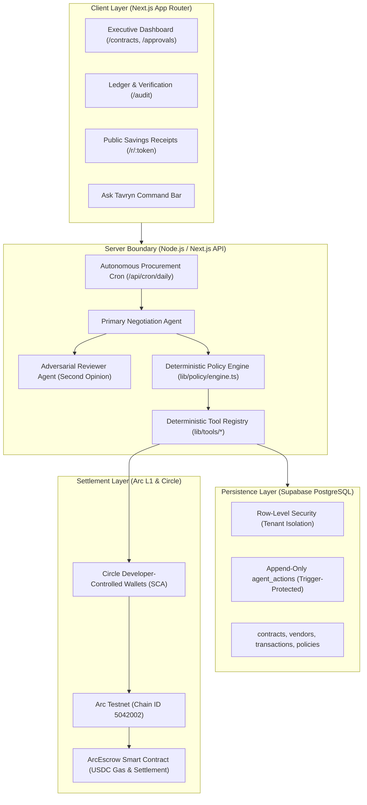
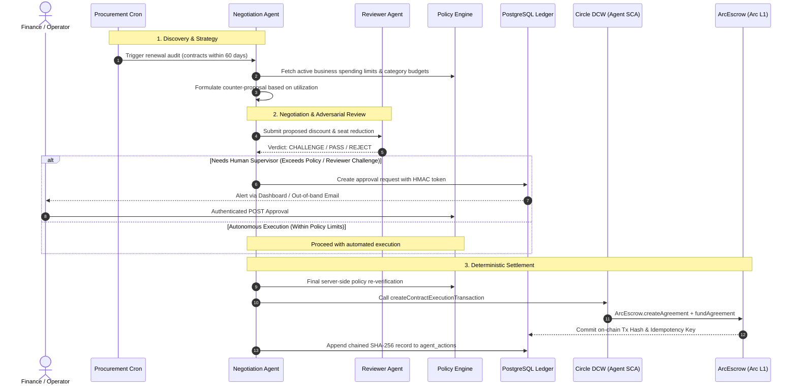

# System Architecture Overview

**Tavryn** is an autonomous B2B procurement protocol and treasury execution engine designed to manage software renewals, negotiate with vendor counterparties, enforce organizational policy bounds, and settle payments in Circle USDC on the Arc Layer-1 blockchain.

---

## 1. Core Architectural Invariants

Tavryn enforces four foundational invariants across the entire codebase:

1. **Strict Separation of Planning vs. Execution:**  
   The Large Language Model (LLM) agent generates proposed counteroffers, drafts reasoning, and selects structured tools. It **never** writes directly to PostgreSQL database tables and **never** signs or broadcasts blockchain transactions.
2. **Deterministic Server-Side Policy Boundary:**  
   All spending ceilings, budget validations, and approval rules execute inside pure TypeScript functions (`lib/policy/engine.ts`). Policy checks run twice: once during proposal generation and once server-side inside execution tools (`create_escrow`) immediately prior to state mutation.
3. **Dual-Role Escrow Execution:**  
   The procurement agent wallet can create and fund agreements within policy caps, but is cryptographically prevented (`msg.sender != agent`) from verifying milestones or releasing escrowed USDC. Only an independent verifier service or human escrow officer can execute milestone approvals.
4. **Append-Only Cryptographic Audit Ledger:**  
   Every agent action is permanently recorded in PostgreSQL with SHA-256 hash chaining back to the genesis action (`000...`). Database engine-level triggers reject any `UPDATE` or `DELETE` queries.

---

## 2. High-Level Component Topology

---

## 3. End-to-End Procurement Lifecycle

---

## 4. Subsystem Details

### 4.1 Client Layer

- **Framework:** Next.js 16 (App Router), React 19, Tailwind CSS v4, Lucide icons.
- **Key Routes & Interactive Surfaces:**
  - `/contracts`: Active contracts, renewals, and vendor overview with embedded `QuickInvoiceDropzone`.
  - `/approvals`: Human-in-the-loop governance queue and HMAC link consumption.
  - `/treasury`: Arc L1 balance, active escrow locks, and direct testnet top-up via `CircleFaucetButton`.
  - `/simulator`: Interactive vendor negotiation sandbox.
  - `/audit`: Live cryptographic hash chain validation and tamper detection.
  - `/r/[token]`: Public, unguessable cryptographic proof-of-savings receipts.
  - `Ask Tavryn` (`components/CommandBar.tsx`): Keyboard-first Cmd+K query bar with modular card response views.

### 4.2 Autonomous Agent Layer

- **Primary Agent:** Orchestrates multi-round negotiations (`lib/agent/negotiate/`) using constrained JSON schemas (`offer`, `commitment_months`, `seat_target`).
- **Adversarial Reviewer Agent (`lib/agent/reviewer.ts`):** Evaluates negotiations independently. Validates seat utilization waste, benchmark discounts, and negotiation fatigue. Issues verdicts (`PASS`, `CHALLENGE`, `REJECT`) to prevent single-agent blindspots.
- **Ask Tavryn Command Bar (`lib/agent/command/`):** Cmd+K interface enforcing strict separation between read-only inquiry tools and state-mutating execution tools.
- **Agent Skills Suite (`.agents/skills/`):** 18 standardized Circle skills for programmatic wallets, gateway, and smart contract orchestration.

### 4.3 Policy & Governance Engine

- **Engine Packages:** `lib/policy/engine.ts` (pure evaluation), `lib/policy/enforcement.ts` (execution authorization & single-use tokens), `lib/policy/types.ts`.
- **Capabilities:**
  - Evaluates maximum auto-approved transaction amounts (`max_auto_transaction`).
  - Enforces category budgets (`software`, `cloud`, `services`).
  - Enforces minimum savings thresholds (`min_savings_pct`).
  - Flags unvetted vendor wallet changes for mandatory supervisor review.

### 4.4 Settlement Layer (Arc L1 + Circle USDC)

- **Blockchain:** Arc Testnet (EVM L1 where USDC is the native gas token).
- **Escrow Contract:** `contracts/contracts/ArcEscrow.sol`.
- **Wallet Infrastructure:** Circle Developer-Controlled Smart Contract Accounts (SCA) via `lib/circle/`.
- **Execution Tools:** Modular escrow tools in `lib/tools/escrow/` (`create.ts`, `release.ts`, `refund.ts`, `dispute.ts`, `idempotency.ts`).
- **Native Gas:** Transactions consume USDC (6 decimals); no separate ETH/gas token needed.

---

## 5. Security & Verification Documentation

For comprehensive threat analysis, smart contract specifications, and operational guides:

- [Security Model & Threat Matrix](./security-model.md)
- [Arc L1 & Circle Integration Notes](./arc-integration.md)
- [Architecture Decision Records (ADRs 001–007)](./decisions.md)
- [ArcEscrow Smart Contract Specification](../contracts/arc-escrow.md)
- [Application Usage Guide](../guides/app-usage.md)
