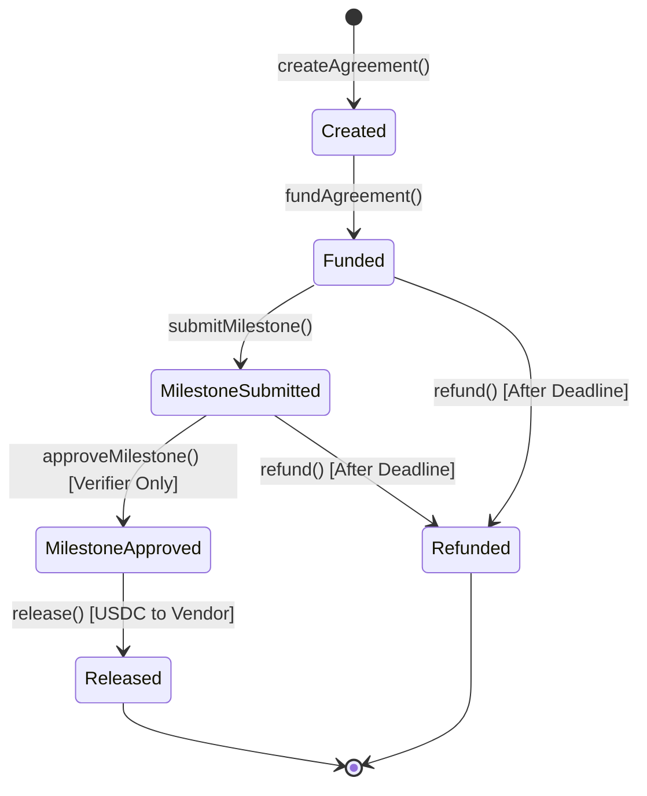

# ArcEscrow Smart Contract Specification & Threat Model

Smart contract escrow implementation with deterministic on-chain spending limits on Arc Testnet for autonomous procurement.

---

## 1. Overview & Architecture

The `ArcEscrow` contract (`contracts/contracts/ArcEscrow.sol`) enforces programmatic escrow agreements on Arc Testnet. USDC functions as the settlement asset (6 decimals, precompile address `0x3600000000000000000000000000000000000000`).

### Agreement Lifecycle

---

## 2. Arc Testnet Network Parameters

| Parameter              | Value                                        | Details                   |
| ---------------------- | -------------------------------------------- | ------------------------- |
| **Chain ID**           | `5042002` (`0x4cef52`)                       | Arc Layer-1 Testnet       |
| **Native Gas / Token** | USDC                                         | 6 Decimals                |
| **USDC Precompile**    | `0x3600000000000000000000000000000000000000` | ERC-20 & Native Interface |
| **RPC Endpoint**       | `https://rpc.testnet.arc.network`            | Public JSON-RPC           |
| **Block Explorer**     | `https://testnet.arcscan.app`                | ArcScan                   |
| **Circle Faucet**      | `https://faucet.circle.com`                  | Testnet USDC Faucet       |

---

## 3. Role-Based Access Control

The contract implements strict role separation between human governance, autonomous procurement agents, and confirmation verifiers:

1. **Owner (`owner`)**:
   - Primary human administrator (Treasury Officer / CFO).
   - Authorizes policy caps (`maxPerAgreement`) and per-category budgets (`setCategoryBudget`).
   - May create agreements for amounts above the autonomous agent policy cap.
   - Updates contract roles (`setRoles`).

2. **Agent (`agent`)**:
   - The autonomous AI procurement engine (Circle Developer-Controlled Wallet).
   - Authorized to create and fund agreements strictly up to `maxPerAgreement` (e.g. 10,000 USDC) and within category budgets.
   - **Explicitly forbidden** from approving milestones (`msg.sender != agent`), preventing the agent from releasing funds to itself or its counterparties without verification.

3. **Verifier (`verifier`)**:
   - Deterministic confirmation verification service or human escrow officer.
   - The **only** role authorized to execute `approveMilestone(agreementId)`.
   - Only approves after automated verification checks pass (price, seats, 12-month term, renewal date).

---

## 4. On-Chain Spending Limits & Protocol Economics

- **`maxPerAgreement`**: Hard cap per agreement initiated by the agent. Any amount exceeding this value triggers a contract revert (`ArcEscrow: Amount exceeds agent policy cap`).
- **`categoryBudgets[category]`**: Tracks spending caps across categories (`software`, `cloud`, `contractors`).
- **`categorySpent[category]`**: Accumulates committed escrow capital. If `categorySpent + amount > categoryBudgets[category]`, agreement creation reverts. Rolled back automatically on refund.
- **`deadline` Timelock**: Every agreement defines an expiration timestamp. If milestones are unapproved after the deadline, the depositor can claim an unconditional refund.
- **Protocol Success Fee (`feeBps` & `feeRecipient`)**:
  - Owner-settable fee rate hard-capped at `MAX_FEE_BPS = 2000` (20.00%).
  - Calculated strictly on realized savings: `feeAmount = (savings * feeBps) / 10000`, where `savings = baselinePrice - negotiatedPrice`.
  - Zero savings guarantees zero fee.
  - Depositor deposits `negotiatedPrice + feeAmount` into escrow.
  - On release, vendor receives `negotiatedPrice` and `feeRecipient` receives `feeAmount`.
  - On cancellation or refund, 100% of deposited funds (price + fee) are refunded back to the depositor.
- **On-Chain Idempotency Keys**:
  - `agreementByKey[idempotencyKey]` tracks unique external agreement hashes.
  - Prevents network retries or concurrent agent loops from double-funding agreements.

---

## 5. Threat Model & Security Mitigations

| Threat                          | Attack Vector                                                                    | Contract Mitigation                                                                                                                   | Severity             |
| ------------------------------- | -------------------------------------------------------------------------------- | ------------------------------------------------------------------------------------------------------------------------------------- | -------------------- |
| **Agent Prompt Injection**      | Attacker tricks the LLM into initiating an unauthorized $50,000 escrow           | Contract enforces `amount <= maxPerAgreement` on-chain for the agent role. Bypassing prompt instructions cannot bypass EVM byte code. | Critical (Mitigated) |
| **Agent Self-Approval**         | Compromised agent tries to release funds prematurely without vendor confirmation | `approveMilestone` requires `onlyVerifier` and explicitly asserts `msg.sender != agent`. Agent has zero milestone approval authority. | Critical (Mitigated) |
| **Double Release (Reentrancy)** | Malicious vendor contract calls `release()` recursively in a token fallback      | `nonReentrant` mutex lock + Checks-Effects-Interactions: state changes to `Status.Released` prior to external ERC-20 transfer.        | High (Mitigated)     |
| **Category Budget Exhaustion**  | Agent rapidly spins up agreements depleting business treasury                    | On-chain budget tracking: `categorySpent[category] + amount <= categoryBudgets[category]` checked atomically.                         | Medium (Mitigated)   |
| **Vendor Non-Delivery**         | Vendor accepts agreement but never provides valid contract renewal               | Timelock refund path: after `deadline`, depositor calls `refund()` to reclaim 100% of escrowed USDC and restore category budget.      | High (Mitigated)     |
| **Premature Refund**            | Depositor attempts to pull funds while vendor is fulfilling obligations          | `refund()` requires `block.timestamp > ag.deadline`. Reverts with `ArcEscrow: Deadline has not passed`.                               | Medium (Mitigated)   |
| **Address Hijacking**           | Attacker substitutes a phishing address for the vendor                           | Server-side address comparison against previous vendor history + vendor screening before escrow funding.                              | High (Mitigated)     |
| **Fee Inflation / Extraction**  | Malicious actor inflates protocol fee to drain depositor funds                   | `feeBps` hard-capped at 2000 (20%) in EVM bytecode; fee calculation strictly proportional to positive savings; 100% refunded on fail. | High (Mitigated)     |
| **Duplicate Agreement Funding** | Network timeout causes agent to retry funding same negotiated deal               | Unique `idempotencyKey` mapping (`agreementByKey`) ensures identical transactions revert or resolve to existing agreement.            | High (Mitigated)     |
